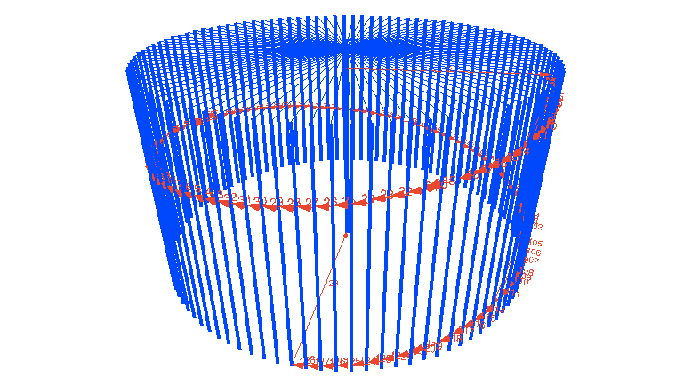
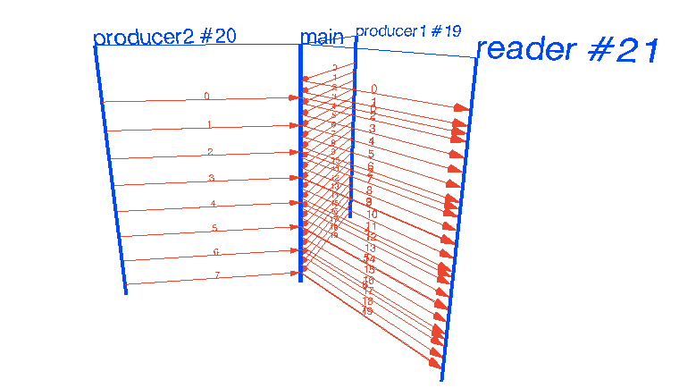
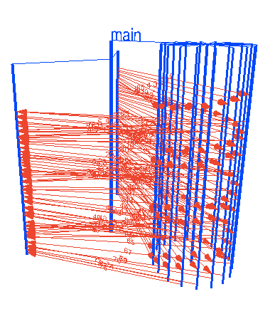
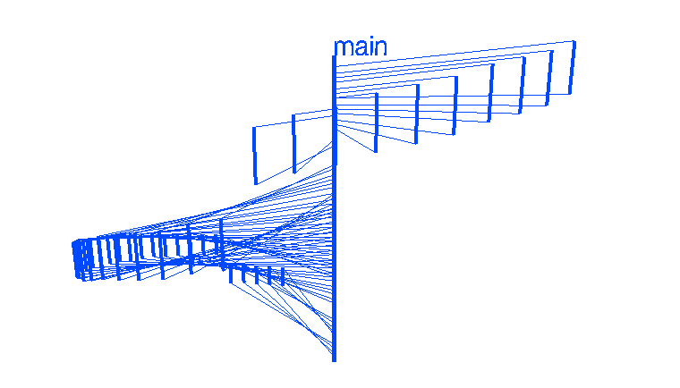
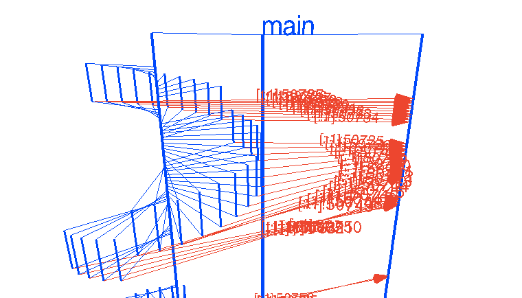

# divan's blog

## 1.Timers
In fact, you can build a simple timer with this approach - create a channel, start goroutine which writes to this channel after given duration and returns this channel to the caller of your func. The caller then blocks on reading from the channel for the exact amount of time.

```go
package main

import "time"

func timer(d time.Duration) <-chan int {
    c := make(chan int)
    go func() {
        time.Sleep(d)
        c <- 1
    }()
    return c
}

func main() {
    for i := 0; i < 24; i++ {
        c := timer(1 * time.Second)
        <-c
    }
}
```


## 2.Ping-pong
Here we have a channel as a table of the ping-pong game. The ball is an integer variable, and two goroutines-players that ‘hit’ the ball, increasing its value (hits counter).

```go
package main

import "time"

func main() {
    var Ball int
    table := make(chan int)
    go player(table)
    go player(table)

    table <- Ball
    time.Sleep(1 * time.Second)
    <-table
}

func player(table chan int) {
    for {
        ball := <-table
        ball++
        time.Sleep(100 * time.Millisecond)
        table <- ball
    }
}
```

Now, let’s run three players instead of two.
```go
go player(table)
go player(table)
go player(table)
```

We can see here that each player takes its turn sequentially and you may wonder why is it so. Why we see this strict order in goroutines receiving the ball?

The answer is because Go runtime holds waiting FIFO queue for receivers (goroutines ready to receive on the particular channel), and in our case every player gets ready just after he passed the ball on the table. Let’s check it with more complex example and run 100 table tennis players.

```go
for i := 0; i < 100; i++ {
    go player(table)
}
```


## 3.Fan-In

One of the popular patterns in the concurrent world is a so called fan-in pattern. It’s the opposite of the fan-out pattern, which we will cover later. To be short, fan-in is a function reading from the multiple inputs and multiplexing all into the single channel.

For example:Fan-In
One of the popular patterns in the concurrent world is a so called fan-in pattern. It’s the opposite of the fan-out pattern, which we will cover later. To be short, fan-in is a function reading from the multiple inputs and multiplexing all into the single channel.

For example:
```go
package main

import (
    "fmt"
    "time"
)

func producer(ch chan int, d time.Duration) {
    var i int
    for {
        ch <- i
        i++
        time.Sleep(d)
    }
}

func reader(out chan int) {
    for x := range out {
        fmt.Println(x)
    }
}

func main() {
    ch := make(chan int)
    out := make(chan int)
    go producer(ch, 100*time.Millisecond)
    go producer(ch, 250*time.Millisecond)
    go reader(out)
    for i := range ch {
        out <- i
    }
}
```

As we can see, first producer generates values each 100 milliseconds, and second one - each 250 milliseconds, but reader receives values from both producers immediately. Effectively, multiplexing happens in a range loop in main.

## 4.Workers (so classic！！！)
The opposite pattern to fan-in is a fan-out or workers pattern. Multiple goroutines can read from a single channel, distributing an amount of work between CPU cores, hence the workers name. In Go, this pattern is easy to implement - just start a number of goroutines with channel as parameter, and just send values to that channel - distributing and multiplexing will be done by Go runtime, automagically :)

```go
package main

import (
    "fmt"
    "sync"
    "time"
)

func worker(tasksCh <-chan int, wg *sync.WaitGroup) {
    defer wg.Done()
    for {
        task, ok := <-tasksCh
        if !ok {
            return
        }
        d := time.Duration(task) * time.Millisecond
        time.Sleep(d)
        fmt.Println("processing task", task)
    }
}

func pool(wg *sync.WaitGroup, workers, tasks int) {
    tasksCh := make(chan int)

    for i := 0; i < workers; i++ {
        go worker(tasksCh, wg)
    }

    for i := 0; i < tasks; i++ {
        tasksCh <- i
    }

    close(tasksCh)
}

func main() {
    var wg sync.WaitGroup
    wg.Add(36)
    go pool(&wg, 36, 50)
    wg.Wait()
}
```


One thing worth to note here: the parallelism. As you can see, all goroutines ‘run’ in parallel, waiting for channel to give them ‘work’ to do. Given the animation above, it’s easy to spot that goroutines receive their work almost immediately one after another. Unfortunately, this animation doesn’t show in color where goroutine really does work or just waits for input, but this exact animation was recorded with GOMAXPROCS=4, so only 4 goroutines effectively run in parallel. We will get to this subject shortly.


***
- GOMAXPROCS

Now, let’s go back to our workers example. Remember, I told that it was run with GOMAXPROCS=4? That’s because all these animations are not art work, they are real traces of real programs.

Let’s refresh our memory on what GOMAXPROCS is.

GOMAXPROCS sets the maximum number of CPUs that can be executing simultaneously.
CPU means logical CPU, of course. I modified workers example a bit to make a real work (not just sleep) and use real CPU time. Then I ran the code without any modification except setting different GOMAXPROCS value. The Linux box had 2 CPUs with 12 cores each, resulting in 24 cores.

So, the first run demonstrates the program running on 1 core, and second - using the power of all 24 cores availiable.

> - running on 1 core


> - using the power of all 24 cores availiable.


The time speed in these animations are different (I wanted all animations to fit the same time/height), so the difference is obvious. With GOMAXPROCS=1, next worker start real work only after previous has finish it’s work. With GOMAXPROCS=24 the speedup is huge, and overhead for multiplexing is negligible.

It’s important to understand, though, that increasing GOMAXPROCS not always boosts performance, and there cases when it actually makes it worse.

***


For now, let’s do something more complex, and start workers that have their own workers (subworkers).

```go
package main

import (
    "fmt"
    "sync"
    "time"
)

const (
    WORKERS    = 5
    SUBWORKERS = 3
    TASKS      = 20
    SUBTASKS   = 10
)

func subworker(subtasks chan int) {
    for {
        task, ok := <-subtasks
        if !ok {
            return
        }
        time.Sleep(time.Duration(task) * time.Millisecond)
        fmt.Println(task)
    }
}

func worker(tasks <-chan int, wg *sync.WaitGroup) {
    defer wg.Done()
    for {
        task, ok := <-tasks
        if !ok {
            return
        }

        subtasks := make(chan int)
        for i := 0; i < SUBWORKERS; i++ {
            go subworker(subtasks)
        }
        for i := 0; i < SUBTASKS; i++ {
            task1 := task * i
            subtasks <- task1
        }
        close(subtasks)
    }
}

func main() {
    var wg sync.WaitGroup
    wg.Add(WORKERS)
    tasks := make(chan int)

    for i := 0; i < WORKERS; i++ {
        go worker(tasks, &wg)
    }

    for i := 0; i < TASKS; i++ {
        tasks <- i
    }

    close(tasks)
    wg.Wait()
}
```


## 5.Servers
Next common pattern is similar to fan-out, but with goroutines spawned for the short period of time, just to accomplish some task. It’s typically used for implementing servers - create a listener, run accept() in a loop and start goroutine for each accepted connection. It’s very expressive and allows to implement server handlers as simple as possible. Take a look at this simple example:

```go
package main

import "net"

func handler(c net.Conn) {
    c.Write([]byte("ok"))
    c.Close()
}

func main() {
    l, err := net.Listen("tcp", ":5000")
    if err != nil {
        panic(err)
    }
    for {
        c, err := l.Accept()
        if err != nil {
            continue
        }
        go handler(c)
    }
}
```


It’s not very interesting - it seems there is nothing happens in terms of concurrency. Of course, under the hood there is a ton of complexity, which is deliberately hidden from us. “Simplicity is complicated”.

But let’s go back to concurrency and add some interaction to our server. Let’s say, each handler wants to write asynchronously to the logger. Logger itself, in our example, is a separate goroutine which does the job.

```go
package main

import (
    "fmt"
    "net"
    "time"
)

func handler(c net.Conn, ch chan string) {
    ch <- c.RemoteAddr().String()
    c.Write([]byte("ok"))
    c.Close()
}

func logger(ch chan string) {
    for {
        fmt.Println(<-ch)
    }
}

func server(l net.Listener, ch chan string) {
    for {
        c, err := l.Accept()
        if err != nil {
            continue
        }
        go handler(c, ch)
    }
}

func main() {
    l, err := net.Listen("tcp", ":5000")
    if err != nil {
        panic(err)
    }
    ch := make(chan string)
    go logger(ch)
    go server(l, ch)
    time.Sleep(10 * time.Second)
}
```


Quite demonstrative, isn’t it? But it’s easy to see that our logger goroutine can quickly become a bottleneck if the number of requests increase and logging action take some time (preparing and encoding data, for example). We can use an already known fan-out pattern. Let’s do it.

## 6.Server + Worker
Server with worker example is a bit advanced version of the logger. It not only does some work but sends the result of its work back to the pool using results channel. Not a big deal, but it extends our logger example to something more practical.

Let’s see the code and animation:

```go
package main

import (
    "net"
    "time"
)

func handler(c net.Conn, ch chan string) {
    addr := c.RemoteAddr().String()
    ch <- addr
    time.Sleep(100 * time.Millisecond)
    c.Write([]byte("ok"))
    c.Close()
}

func logger(wch chan int, results chan int) {
    for {
        data := <-wch
        data++
        results <- data
    }
}

func parse(results chan int) {
    for {
        <-results
    }
}

func pool(ch chan string, n int) {
    wch := make(chan int)
    results := make(chan int)
    for i := 0; i < n; i++ {
        go logger(wch, results)
    }
    go parse(results)
    for {
        addr := <-ch
        l := len(addr)
        wch <- l
    }
}

func server(l net.Listener, ch chan string) {
    for {
        c, err := l.Accept()
        if err != nil {
            continue
        }
        go handler(c, ch)
    }
}

func main() {
    l, err := net.Listen("tcp", ":5000")
    if err != nil {
        panic(err)
    }
    ch := make(chan string)
    go pool(ch, 4)
    go server(l, ch)
    time.Sleep(10 * time.Second)
}
```


We distributed work between 4 goroutines, effectively improving the throughput of the logger, but from this animation, we can see that logger still may be the source of problems. Thousands of connections converge in a single channel before being distributed and it may result in a logger being bottleneck again. But, of course, it will happen on much higher loads.

## 7.Concurrent Prime Sieve
Enough fan-in/fan-out fun. Let’s see more sophisticated concurrency algorithms. One of my favorite examples is a Concurrent Prime Sieve, found in “Go Concurrency Patterns” talk. Prime Sieve, or Sieve of Eratosthenes is an ancient algorithm for finding prime number up to the given limit. It works by eliminating multiples of all primes in a sequential manner. Naive algorithm is not really efficient, especially on multicore machines.

The concurrent variant of this algorithm uses goroutines for filtering numbers - one goroutine per every prime discovered, and channels for sending numbers from the generator to filters. When prime is found, it’s being sent via the channel to the main for output. Of course, this algorithm is also not very efficient, especially if you want to find large primes and look for the lowest Big O complexity, but I find it extremely elegant.

```go
// A concurrent prime sieve
package main

import "fmt"

// Send the sequence 2, 3, 4, ... to channel 'ch'.
func Generate(ch chan<- int) {
    for i := 2; ; i++ {
        ch <- i // Send 'i' to channel 'ch'.
    }
}

// Copy the values from channel 'in' to channel 'out',
// removing those divisible by 'prime'.
func Filter(in <-chan int, out chan<- int, prime int) {
    for {
        i := <-in // Receive value from 'in'.
        if i%prime != 0 {
            out <- i // Send 'i' to 'out'.
        }
    }
}

// The prime sieve: Daisy-chain Filter processes.
func main() {
    ch := make(chan int) // Create a new channel.
    go Generate(ch)      // Launch Generate goroutine.
    for i := 0; i < 10; i++ {
        prime := <-ch
        fmt.Println(prime)
        ch1 := make(chan int)
        go Filter(ch, ch1, prime)
        ch = ch1
    }
}
```


Feel free to play with this animation in interactive mode. I like how illustrative it is - it really can help understand this algorithm better. The generate goroutine emits every integer number, starting from 2, and each new goroutine filters out only specific prime multiples - 2, 3, 5, 7…, sending first found prime to main. If you rotate it to see from the top, you’ll see all numbers being sent from goroutines to main are prime numbers. Beautiful algorithm, especially in 3D.