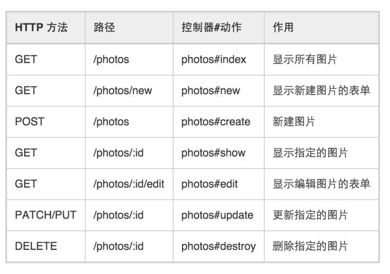

#专题5：Golang RESTful API

讲师：何李石

##1.大纲

- 什么是 RESTful API 
- RESTful API 最佳实践
- 如何将 API REST 化
- 用 Go 实现一个简易的 RESTful 框架

##2.什么是 RESTful API 

- REST == Representational State Transfer, 表现层状态转化
- 表现层，我们看到的是资源（Resources）
- HTTP 是一种无状态的协议，资源的状态存储在服务端
- 状态转化，是指通过客户端的请求，来修改服务端资源的存储状态（CURD）

##3. RESTful API 最佳实践

(1).资源：操作的对象，主体：
>名词，复数表示（举例：photos）

(2).动作：（GET / PUT / POST / PATCH / DELETE / ...）
> 修改状态的方式，符合 CURD

(3).访问：永远使用 SSL

(4).版本：1、HEAD中；2、URL 中放主版本，Header 中放子版本

(5).在URL中提供参数的过滤、排序、搜索

(6).提供返回值查询

> GET /ticketsfields=id,subject,name

(7).PUT/POST/PATCH：
>返回创建、更新的资源

(8).返回正确的状态码

(9).返回 JSON 格式数据

(10).统一命名规范（JavaScript）

(11).利用 HTTP 缓存

(12).提供 API 限速访问

(13).文档化：参考自动化文档工具：http://swagger.io/

[星球大战API：](https://swapi.co/)
[最佳实践参考:](http://www.vinaysahni.com/best-practices-for-a-pragmatic-restful-api)



##4.如何将 API REST 化

- http.ServeMux 做路由
- http.Request.Method 获取请求的“方法”

代码：
``` go
func GetBooks(rw http.ResponseWriter, request *http.Request) {
    if request.Method == "GET" { // 只接受 GET 请求
        rw.Write([]byte("Hello world."))
    }
}
func CreateBook(rw http.ResponseWriter, request *http.Request) {
    if request.Method == "POST" { // 只接受 POST 请求
        rw.Write([]byte("Hello world."))
    }
}
func UpdateBook(rw http.ResponseWriter, request *http.Request) {
    if request.Method == "PUT" { // 只接受 PUT 请求
        rw.Write([]byte("Hello world."))
    }
}

func main() {
    mux := http.NewServeMux()
    mux.HandleFunc("/", GetBooks)
    mux.HandleFunc("/new", CreateBook)
    mux.HandleFunc("/update", UpdateBook)

    http.ListenAndServe(":3000", mux)
}
```


##5.用 Go 实现一个简易的 RESTful 框架

(1).资源表示：
```go
type Resource interface {
    Get(values url.Values) (int, interface{})
    Post(values url.Values) (int, interface{})
    Put(values url.Values) (int, interface{})
    Delete(values url.Values) (int, interface{})
}
```
(2).动作：

(3).参数
```
type url.Values map[string][]string
```

(4).资源 + 动作 + 参数 ＝ 一个请求

(5).对外接口 API ——路由
```
type API struct {
    mux     *http.ServeMux
}
```
(6).给资源分配 handler
```
type GetSupported interface {
    Get(values url.Values) (int, interface{})
}

func (api *API) requestHandler(resource interface{}) http.HandlerFunc {
    return func(rw http.ResponseWriter, request *http.Request) {

    if request.ParseForm() != nil {
        rw.WriteHeader(http.StatusBadRequest)
        return
    }

    var handler func(url.Values, http.Header) (int, interface{}, http.Header)

    switch request.Method {
    case GET:
            if resource, ok := resource.(GetSupported); ok {
                handler = resource.Get
            }
    case POST:
            if resource, ok := resource.(PostSupported); ok {
                handler = resource.Post
            }
        ......
        default:
			handler = resource.NotAllowed
		}
}
```
(7).给 handler 配置路由
```
func (api *API) Register(resource interface{}, paths ...string) { // 可以对应多个路径
    for _, path := range paths {
        // Resource 实现了什么方法就注册什么方法
        api.Mux().HandleFunc(path, api.requestHandler(resource))
    }
}
```
(7).用法
```
type Book struct {
}

func (book Book) Get(values url.Values, headers http.Header) (int, interface{}, http.Header) {
    return 200, data, nil
}
func (book Book) Post(values url.Values, headers http.Header) (int, interface{}, http.Header) {
    return 200, data, nil
}
func (book Book) Put(values url.Values, headers http.Header) (int, interface{}, http.Header) {
    return 200, data, nil
}

func (book Book) NotAllowed() {
    return 451, data, nil 
}

book := new(Book)
var api = NewAPI()
api.Register(book, "/books", "/bar", "/baz") // 注册多个路径
go api.Start(3000)
resp, err := http.Get("http://localhost:3000/books")
if err != nil {
    t.Error(err)
}
```