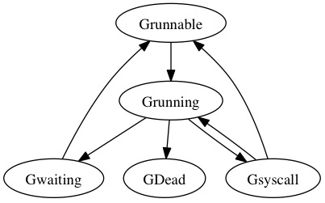
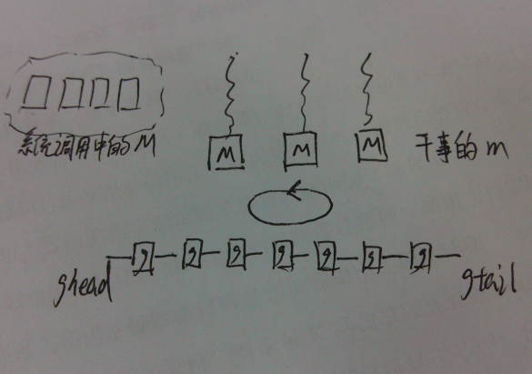

# goroutine 调度

#[1.调度器相关数据结构](https://tiancaiamao.gitbooks.io/go-internals/content/zh/05.1.html)


Go的调度的实现，涉及结构体G，结构体M，结构体P，以及Sched结构体

运行时库用这几个数据结构来实现goroutine的调度，管理goroutine和物理线程的运行。

## 结构体 G
G是goroutine的缩写，相当于操作系统中的进程控制块，在这里就是goroutine的控制结构，是对goroutine的抽象。其中包括goid是这个goroutine的ID，status是这个goroutine的状态。

goroutine切换时的上下文信息是保存在结构体的sched域中的。goroutine是轻量级的“线程”或者称为协程，切换时变不必陷入到操作系统内核中，所以保存过程很轻量。看一下结构体G中的Gobuf，其实只保存了当前栈指针，程序计数器，以及goroutine自身。


## 结构体M

M是machine的缩写，是对机器的抽象，每个m都是对应到一条操作系统的物理线程。M必须关联了P才可以执行Go代码，但是当它处理阻塞或者系统调用中时，可以不需要关联P。

M中还有一个MCache，是当前M的内存的缓存。M也是和G一样有一个常驻寄存器变量，代表当前的M。同时存在很多的M，就是有很多的物理线程。

结构体M中有两个G是需要关注一下的，一个是curg，代表结构体M当前绑定的结构体G。另一个是g0，是带有调度栈的goroutine，这是一个比较特殊的goroutine。普通的goroutine的栈是在堆上分配的可增长的栈，而g0的栈是M对应的线程的栈。所有调度相关的代码，会先切换到该goroutine的栈中再执行。

## 结构体P

Go1.1中新加入的一个数据结构，它是Processor的缩写。结构体P的加入是为了提高Go程序的并发度，实现更好的调度。


- **M代表OS线程。**
- **P代表Go代码执行时需要的资源。**


当M执行Go代码时，它需要关联一个P，当M为idle或者在系统调用中时，它也需要P。

- 有刚好GOMAXPROCS个P。
- 所有的P被组织为一个数组，在P上实现了工作流窃取的调度器。

注意，跟G不同的是，P的状态中是不存在waiting的。MCache是被移到了P中，但是在结构体M中也还保留着。在P中有一个Grunnable的goroutine的队列，这是一个P的局部队列。当P去执行Go代码时，它会优先从自己的这个局部队列中去取，这时可以不用加锁，提高了并发度。如果发现这个队列为空了，则去其它P中的队列中拿一半过来，这样实现工作流窃取的调度。这种情况下是需要给调用器进行加锁的。

## Sched

Sched是调度实现中使用的数据结构，该结构体的定义在文件proc.c中。

大多数需要的的信息都已放在了结构体M，结构体G和结构体P中，Sched结构体只是一个壳。可以看到，其中有M的idle队列，P的idle队列，以及一个全局的就绪的G队列。Sched结构体中的Lock是非常必须的，如果M或P等做一些非局部的操作，它们一般需要先锁住调度器。


***
# 2.goroutine的生老病死

这里主要将注意力集中到结构体G中，以goroutine为主线。


## goroutine的创建
>runtime.newproc:

一个goroutine的出生，所有的新的goroutine都是通过这个函数创建的。

runtime.newproc(size, f, args)功能就是创建一个新的g，这个函数不能用分段栈，因为它假设参数的放置顺序是紧接着函数f的.

分段栈会破坏这个布局，所以在代码中加入了标记#pragma textflag 7表示不使用分段栈。它会调用函数newproc1，在newproc1中可以使用分段栈。真正的工作是调用newproc1完成的。

>runtime.newm

功能跟newproc相似,前者分配一个goroutine,而后者分配一个M。其实一个M就是一个操作系统线程的抽象，可以看到它会调用runtime.newosproc。

## 进出系统调用
...

## goroutine的消亡以及状态变化
...
> 
在newproc1中新建的goroutine被设置为Grunnable状态，投入运行时设置成Grunning。在entersyscall的时候goroutine的状态被设置为Gsyscall，到出系统调用时根据它是从阻塞系统调用中出来还是非阻塞系统调用中出来，又会被设置成Grunning或者Grunnable的状态。在goroutine最终退出的runtime.exit函数中，goroutine被设置为Gdead状态。




# 3.设计与演化

## 线程池
一个常规的 线程池+任务队列 的模型如图所示：


把每个**工作线程**叫worker的话，每条线程运行一个worker，每个worker做的事情就是不停地从队列中取出任务并执行：

```go
while(!empty(queue)) {
    q = get(queue); //从任务队列中取一个(涉及加锁等)
    q->callback(); //执行该任务
}
```

假设我们有一些“任务”，任务是一个可运行的东西，也就是只要满足Run函数，它就是一个任务。所以我们就把这个任务叫作接口G吧。

```go
type G interface {
    Run() 
}
```

我们有一个全局的任务队列，里面包含很多可运行的任务。线程池的各个线程从全局的任务队列中取任务时，显然是需要并发保护的，所以有下面这个结构体：

```go
type Sched struct {
    allg  []G
    lock    *sync.Mutex
}
```

以及它的变量

```go
var sched Sched
```

每条线程是一个worker，这里我们给worker换个名字，就把它叫M吧。前面已经说过了，worker做的事情就是不停的去任务队列中取一个任务出来执行。于是用Go语言大概可以写成这样子：

```go
func M() {
    for {
        sched.lock.Lock()    //互斥地从就绪G队列中取一个g出来运行
        if sched.allg > 0 {
            g := sched.allg[0]
            sched.allg = sched.allg[1:]
            sched.lock.Unlock()
            g.Run()        //运行它
        } else {
            sched.lock.Unlock()
        }
    }
}
```
接下来，将整个系统启动：

```go
for i:=0; i<GOMAXPROCS; i++ {
    go M()
}
```
假定我们有一个满足G接口的main，然后它在自己的Run中不断地将新的任务挂到sched.allg中，这个线程池+任务队列的系统模型就会一直运行下去。

可以看到，这里在代码取中故意地用Go语言中的G，M，甚至包括GOMAXPROCS等取名字。其实本质上，Go语言的调度层无非就是这样一个工作模式的：几条物理线程，不停地取goroutine运行。

## 系统调用

上面的情形太简单了，就是工作线程不停地取goroutine运行，这个还不能称之为调度。调度之所以为调度，是因为有一些复杂的控制机制，比如哪个goroutine应该被运行，它应该运行多久，什么时候将它换出来。用前面的代码来说明Go的调度会有一些小问题。Run函数会一直执行，在它结束之前不会返回到调用器层面。那么假设上面的任务中Run进入到一个阻塞的系统调用了，那么M也就跟着一起阻塞了，实际工作的线程就少了一个，无法充分利用CPU。

一个简单的解决办法是在进入系统调用之前再制造一个M出来干活，这样就填补了这个进入系统调用的M的空缺，始终保证有GOMAXPROCS个工作线程在干活了。

```go
func entersyscall() {
    go M()
}
```
那么出系统调用时怎么办呢？如果让M接着干活，岂不超过了GOMAXPROCS个线程了？所以这个M不能再干活了，要限制干活的M个数为GOMAXPROCS个，多了则让它们闲置(物理线程比CPU多很多就没意义了，让它们相互抢CPU反而会降低利用率)。

```go
func exitsyscall() {
    if len(allm) >= GOMAXPROCS {
        sched.lock.Lock()
        sched.allg = append(sched.allg, g)    //把g放回到队列中
        sched.lock.Unlock()
        time.Sleep()    //这个M不再干活
    }
}
```
于是就变成了这样子:


其实这个也很好理解，就像线程池做负载调节一样，当任务队列很长后，忙不过来了，则再开几条线程出来。而如果任务队列为空了，则可以释放一些线程。

## 协程与保存上下文

大家都知道阻塞于系统调用，会白白浪费CPU。而使用异步事件或回调的思维方式又十分反人类。上面的模型既然这么简单明了，为什么不这么用呢？其实上面的东西看上去简单，但实现起来确不那么容易。

将一个正在执行的任务yield出去，再在某个时刻再弄回来继续运行，这就涉及到一个麻烦的问题，即保存和恢复运行时的上下文环境。

在此先引入协程的概念。**协程是轻量级的线程，它相对线程的优势就在于协程非常轻量级，进行切换以及保存上下文环境代价非常的小。**协程的具体的实现方式有多种，上面就是其中一种基于线程池的实现方式。每个协程是一个任务，可以保存和恢复任务运行时的上下文环境。

协程一类的东西一般会提供类似yield的函数。协程运行到一定时候就主动调用yield放弃自己的执行，把自己再次放回到任务队列中等待下一次调用时机等等。

其实Go语言中的goroutine就是协程。***每个结构体G中有一个sched域就是用于保存自己上下文的***。这样，这种goroutine就可以被换出去，再换进来。这种上下文保存在用户态完成，不必陷入到内核，非常的轻量，速度很快。保存的信息很少，只有当前的PC,SP等少量信息。只是由于要优化，所以代码看上去更复杂一些，比如要重用内存空间所以会有gfree和mhead之类的东西。

