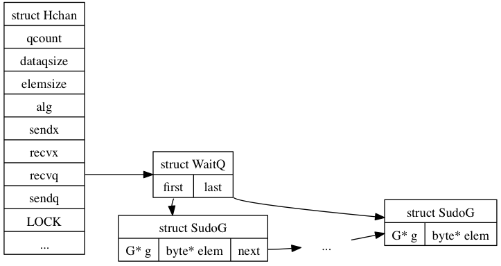

# 高级数据结构


- 1.channel
- 2.interface
- 3.方法

# 1.channel
## channel数据结构

Go语言channel是first-class的，意味着它可以被存储到变量中，可以作为参数传递给函数，也可以作为函数的返回值返回。作为Go语言的核心特征之一，虽然channel看上去很高端，但是其实channel仅仅就是一个数据结构而已.

```go

type hchan struct {
	qcount   uint           // total data in the queue
	dataqsiz uint           // size of the circular queue
	buf      unsafe.Pointer // points to an array of dataqsiz elements
	elemsize uint16
	closed   uint32
	elemtype *_type // element type
	sendx    uint   // send index
	recvx    uint   // receive index
	recvq    waitq  // list of recv waiters
	sendq    waitq  // list of send waiters
	lock     mutex
}

type waitq struct {
	first *sudog
	last  *sudog
}
```

其中一个核心的部分是存放channel数据的环形队列，由qcount和elemsize分别指定了队列的容量和当前使用量。dataqsize是队列的大小。elemalg是元素操作的一个Alg结构体，记录下元素的操作，如copy函数，equal函数，hash函数等。



## 读写channel操作

先看写channel的操作，基本的写channel操作，在底层运行时库中对应的是一个runtime.chansend函数。

c <- v
在运行时库中会执行：

void runtime·chansend(ChanType *t, Hchan *c, byte *ep, bool *pres, void *pc)
其中c就是channel，ep是取变量v的地址。这里的传值约定是调用者负责分配好ep的空间，仅需要简单的取变量地址就够了。pres参数是在select中的通道操作使用的。

这个函数首先会区分是同步还是异步。同步是指chan是不带缓冲区的，因此可能写阻塞，而异步是指chan带缓冲区，只有缓冲区满才阻塞。

在同步的情况下，由于channel本身是不带数据缓存的，这时首先会查看Hchan结构体中的recvq链表时否为空，即是否有因为读该管道而阻塞的goroutine。如果有则可以正常写channel，否则操作会阻塞。

recvq不为空的情况下，将一个SudoG结构体出队列，将传给通道的数据(函数参数ep)拷贝到SudoG结构体中的elem域，并将SudoG中的g放到就绪队列中，状态置为ready，然后函数返回。

如果recvq为空，否则要将当前goroutine阻塞。此时将一个SudoG结构体，挂到通道的sendq链表中，这个SudoG中的elem域是参数eq，SudoG中的g是当前的goroutine。当前goroutine会被设置为waiting状态并挂到等待队列中。

在异步的情况，如果缓冲区满了，也是要将当前goroutine和数据一起作为SudoG结构体挂在sendq队列中，表示因写channel而阻塞。否则也是先看有没有recvq链表是否为空，有就唤醒。

跟同步不同的是在channel缓冲区不满的情况，这里不会阻塞写者，而是将数据放到channel的缓冲区中，调用者返回。

读channel的操作也是类似的，对应的函数是runtime.chansend。一个是收一个是发，基本的过程都是差不多的。

需要注意的是几种特殊情况下的通道操作--空通道和关闭的通道。

空通道是指将一个channel赋值为nil，或者定义后不调用make进行初始化。按照Go语言的语言规范，读写空通道是永远阻塞的。其实在函数runtime.chansend和runtime.chanrecv开头就有判断这类情况，如果发现参数c是空的，则直接将当前的goroutine放到等待队列，状态设置为waiting。

读一个关闭的通道，永远不会阻塞，会返回一个通道数据类型的零值。这个实现也很简单，将零值复制到调用函数的参数ep中。写一个关闭的通道，则会panic。关闭一个空通道，也会导致panic。

## select的实现

select-case中的chan操作编译成了if-else。比如：
```go
select {
case v = <-c:
        ...foo
default:
        ...bar
}
```
会被编译为:

```go
if selectnbrecv(&v, c) {
        ...foo
} else {
        ...bar
}
```
类似地

```go
select {
case v, ok = <-c:
    ... foo
default:
    ... bar
}
```
会被编译为:
```go
if c != nil && selectnbrecv2(&v, &ok, c) {
    ... foo
} else {
    ... bar
}
```
接下来就是看一下selectnbrecv相关的函数了。其实没有任何特殊的魔法，这些函数只是简单地调用runtime.chanrecv函数，只不过设置了一个参数，告诉当runtime.chanrecv函数，当不能完成操作时不要阻塞，而是返回失败。也就是说，所有的select操作其实都仅仅是被换成了if-else判断，底层调用的不阻塞的通道操作函数。

在Go的语言规范中，select中的case的执行顺序是随机的，而不像switch中的case那样一条一条的顺序执行。那么，如何实现随机呢？

select和case关键字使用了下面的结构体：

```go

// Select statement header.
// Known to compiler.
// Changes here must also be made in src/cmd/internal/gc/select.go's selecttype.
type hselect struct {
	tcase     uint16   // total count of scase[]
	ncase     uint16   // currently filled scase[]
	pollorder *uint16  // case poll order
	lockorder **hchan  // channel lock order
	scase     [1]scase // one per case (in order of appearance)
}

// Select case descriptor.
// Known to compiler.
// Changes here must also be made in src/cmd/internal/gc/select.go's selecttype.
type scase struct {
	elem        unsafe.Pointer // data element
	c           *hchan         // chan
	pc          uintptr        // return pc
	kind        uint16
	so          uint16 // vararg of selected bool
	receivedp   *bool  // pointer to received bool (recv2)
	releasetime int64
}

```

每个select都对应一个Select结构体。在Select数据结构中有个Scase数组，记录下了每一个case，而Scase中包含了Hchan。然后pollorder数组将元素随机排列，这样就可以将Scase乱序了。


# 2.interface

interface是Go语言中最成功的设计之一，空的interface可以被当作“鸭子”类型使用，它使得Go这样的静态语言拥有了一定的动态性，但却又不损失静态语言在类型安全方面拥有的编译时检查的优势。

依赖于接口而不是实现，优先使用组合而不是继承。

## Eface和Iface

interface实际上就是一个结构体，包含两个成员。其中一个成员是指向具体数据的指针，另一个成员中包含了类型信息。空接口和带方法的接口略有不同，下面分别是空接口和带方法的接口是使用的数据结构：
```go
type iface struct {
	tab  *itab
	data unsafe.Pointer
}

type eface struct {
	_type *_type
	data  unsafe.Pointer
}
```

先看Eface，它是interface{}底层使用的数据结构。数据域中包含了一个void*指针，和一个类型结构体的指针。interface{}扮演的角色跟C语言中的void*是差不多的，Go中的任何对象都可以表示为interface{}。不同之处在于，interface{}中有类型信息，于是可以实现反射。

类型信息的结构体定义如下：
```go

// Needs to be in sync with ../cmd/internal/ld/decodesym.go:/^func.commonsize,
// ../cmd/internal/gc/reflect.go:/^func.dcommontype and
// ../reflect/type.go:/^type.rtype.
type _type struct {
	size       uintptr
	ptrdata    uintptr // size of memory prefix holding all pointers
	hash       uint32
	_unused    uint8
	align      uint8
	fieldalign uint8
	kind       uint8
	alg        *typeAlg
	// gcdata stores the GC type data for the garbage collector.
	// If the KindGCProg bit is set in kind, gcdata is a GC program.
	// Otherwise it is a ptrmask bitmap. See mbitmap.go for details.
	gcdata  *byte
	_string *string
	x       *uncommontype
	ptrto   *_type
	zero    *byte // ptr to the zero value for this type
}
```
其实在前面我们已经见过它了。精确的垃圾回收中，就是依赖Type结构体中的gc域的。不同类型数据的类型信息结构体并不完全一致，Type是类型信息结构体中公共的部分，其中size描述类型的大小，hash数据的hash值，align是对齐，fieldAlgin是这个数据嵌入结构体时的对齐，kind是一个枚举值，每种类型对应了一个编号。alg是一个函数指针的数组，存储了hash/equal/print/copy四个函数操作。UncommonType是指向一个函数指针的数组，收集了这个类型的实现的所有方法。

在reflect包中有个KindOf函数，返回一个interface{}的Type，其实该函数就是简单的取Eface中的Type域。

Iface和Eface略有不同，它是带方法的interface底层使用的数据结构。data域同样是指向原始数据的，而Itab的结构如下：


```go

// layout of Itab known to compilers
// allocated in non-garbage-collected memory
type itab struct {
	inter  *interfacetype
	_type  *_type
	link   *itab
	bad    int32
	unused int32
	fun    [1]uintptr // variable sized
}
```
Itab中不仅存储了Type信息，而且还多了一个方法表fun[]。一个Iface中的具体类型中实现的方法会被拷贝到Itab的fun数组中。

## 具体类型向接口类型赋值

将具体类型数据赋值给interface{}这样的抽象类型，中间会涉及到类型转换操作。从接口类型转换为具体类型(也就是反射)，也涉及到了类型转换。这个转换过程中做了哪些操作呢？先看将具体类型转换为接口类型。如果是转换成空接口，这个过程比较简单，就是返回一个Eface，将Eface中的data指针指向原型数据，type指针会指向数据的Type结构体。

## reflect

reflect就是给定一个接口类型的数据，得到它的具体类型的类型信息，它的Value等。reflect包中的TypeOf和ValueOf函数分别做这个事情。

还有像

    v, ok := i.(T)
这样的语法，也是判断一个接口i的具体类型是否为类型T，如果是则将其值返回给v。这跟上面的类型转换一样，也会检测转换是否合法。不过这里的检测是在运行时执行的。